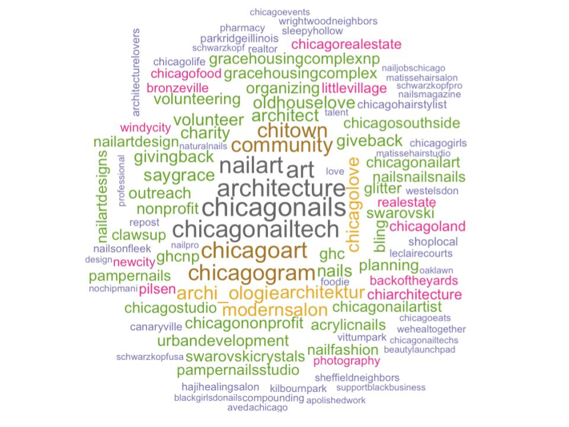

```{r setup, include=FALSE}
knitr::opts_chunk$set(echo = TRUE)
library(rvest)
library(dplyr)
library(tidyverse)
library(tidytext)
library(stringr)
library(knitr)
library(kableExtra)
library(sf)
library(viridis) # new color scheme
library(stringi)
#library("wordcloud")
library(rjson)
```

```{r, echo=FALSE,message=FALSE,error=FALSE,warning=FALSE}
chicagoCommunityAreas <- st_read("ChicagoCommunityAreas/geo_export_205a87a5-eb5f-4759-bdff-374abe5c5093.shp", quiet = TRUE)

finalChicagoData <- 
  read.csv("finalChicagoData.csv") %>% 
  mutate(text = as.character(text))
```

```{r, echo=FALSE,message=FALSE,error=FALSE,warning=FALSE}
FarNorthSide <- c("ROGERS PARK", "WEST RIDGE", "UPTOWN", "LINCOLN SQUARE", "EDISON PARK", "NORWOOD PARK", "JEFFERSON PARK", "FOREST GLEN", "NORTH PARK", "ALBANY PARK", "OHARE", "EDGEWATER")

NorthSide <- c("NORTH CENTER", "LAKE VIEW", "LINCOLN PARK", "AVONDALE", "LOGAN SQUARE")

NorthwestSide <- c("PORTAGE PARK", "IRVING PARK", "DUNNING", "MONTCLARE", "BELMONT CRAGIN", "HERMOSA")

CentralNearNorthNearSouthSide <- c("NEAR NORTH SIDE", "LOOP", "NEAR SOUTH SIDE")

WestAndNearWestSide <- c("HUMBOLDT PARK", "WEST TOWN", "AUSTIN", "WEST GARFIELD PARK", "EAST GARFIELD PARK", "NEAR WEST SIDE", "NORTH LAWNDALE", "SOUTH LAWNDALE", "LOWER WEST SIDE")

SouthwestSide <- c("GARFIELD RIDGE", "ARCHER HEIGHTS", "BRIGHTON PARK", "MCKINLEY PARK", "NEW CITY", "WEST ELSDON", "GAGE PARK", "CLEARING", "WEST LAWN", "CHICAGO LAWN", "WEST ENGLEWOOD", "ENGLEWOOD")

SouthSide <- c("ARMOUR SQUARE", "DOUGLAS", "OAKLAND", "FULLER PARK", "GRAND BOULEVARD", "KENWOOD", "WASHINGTON PARK", "HYDE PARK", "WOODLAWN", "SOUTH SHORE", "BRIDGEPORT", "GREATER GRAND CROSSING")

FarSouthwestSide <- c("ASHBURN", "AUBURN GRESHAM", "BEVERLY", "WASHINGTON HEIGHTS", "MOUNT GREENWOOD", "MORGAN PARK")

FarSouthSide <- c("CHATHAM", "AVALON PARK", "SOUTH CHICAGO", "BURNSIDE", "CALUMET HEIGHTS", "ROSELAND", "PULLMAN", "SOUTH DEERING", "EAST SIDE", "WEST PULLMAN", "RIVERDALE", "HEGEWISCH")
```

```{r, echo=FALSE,message=FALSE,error=FALSE,warning=FALSE}
# mean likes per post in districts
meanDistrictLikes <-
  finalChicagoData %>% 
  group_by(district) %>% 
  summarise(avgLikes = mean(likes)) 

# mean comments per post in districts
meanDistrictCommentCounts <-
  finalChicagoData %>% 
  group_by(district) %>% 
  summarise(avgComments = mean(commentCount)) 
```

```{r, echo=FALSE,message=FALSE,error=FALSE,warning=FALSE}
SocioeconomicChicagoDistrict <- read.csv("CensusDataSocioeconomicChicago2008_2012.csv")

# mean per capita income in neighborhoods
PerCapitaIncomeChicagoNeighborhood <-
  SocioeconomicChicagoDistrict %>% 
  mutate(community = toupper(COMMUNITY.AREA.NAME)) %>% 
  filter(community != "CHICAGO") %>% 
  mutate(community = ifelse(community == "O'HARE", "OHARE", community)) %>% 
  mutate(community = ifelse(community == "WASHINGTON HEIGHT", "WASHINGTON HEIGHTS", community)) %>% 
  mutate(community = ifelse(community == "MONTCLAIRE", "MONTCLARE", community)) %>% 
  select(community, PER.CAPITA.INCOME)

# mean per capita income in districts
PerCapitaIncomeChicagoDistrict <-
  PerCapitaIncomeChicagoNeighborhood %>% 
  mutate(district = ifelse(community %in% FarNorthSide, "Far North Side", NA)) %>%
  mutate(district = ifelse(community %in% NorthSide, "North Side", district)) %>% 
  mutate(district = ifelse(community %in% NorthwestSide, "Northwest Side", district)) %>% 
  mutate(district = ifelse(community %in% CentralNearNorthNearSouthSide, "Central", district)) %>% 
  mutate(district = ifelse(community %in% WestAndNearWestSide, "West Side", district)) %>% 
  mutate(district = ifelse(community %in% SouthwestSide, "Southwest Side", district)) %>% 
  mutate(district = ifelse(community %in% SouthSide, "South Side", district)) %>% 
  mutate(district = ifelse(community %in% FarSouthwestSide, "Far Southwest Side", district)) %>% 
  mutate(district = ifelse(community %in% FarSouthSide, "Far Southeast Side", district)) %>% 
  group_by(district) %>% 
  summarise(PER.CAPITA.INCOME = mean(PER.CAPITA.INCOME))
```

```{r, echo=FALSE,message=FALSE,error=FALSE,warning=FALSE}
RaceAgeChicagoNeighborhood <- read.csv("ReferenceCCA20112015.csv")

# majority race in neighborhoods
RaceChicagoNeighborhood <- 
  RaceAgeChicagoNeighborhood %>% 
  mutate(community = toupper(GEOG)) %>%
  mutate(community = ifelse(community == "O'HARE", "OHARE", community)) %>% 
  mutate(community = ifelse(community == "THE LOOP", "LOOP", community)) %>% 
  select(community, TOT_POP, WHITE, HISP, BLACK, ASIAN, OTHER) %>% 
  mutate(WHITE = WHITE/TOT_POP, 
         HISP = HISP/TOT_POP,
         BLACK = BLACK/TOT_POP,
         ASIAN = ASIAN/TOT_POP,
         OTHER = OTHER/TOT_POP) %>% 
  rownames_to_column('id') %>%  # creates an ID number
  gather(raceMajority, max, WHITE:OTHER) %>% 
  group_by(id) %>% 
  slice(which.max(max))

# majority race in districts
RaceChicagoDistrict <- 
  RaceAgeChicagoNeighborhood %>% 
  mutate(community = toupper(GEOG)) %>%
  mutate(community = ifelse(community == "O'HARE", "OHARE", community)) %>% 
  mutate(community = ifelse(community == "THE LOOP", "LOOP", community)) %>% 
  select(community, TOT_POP, WHITE, HISP, BLACK, ASIAN, OTHER) %>% 
  mutate(district = ifelse(community %in% FarNorthSide, "Far North Side", NA)) %>%
  mutate(district = ifelse(community %in% NorthSide, "North Side", district)) %>% 
  mutate(district = ifelse(community %in% NorthwestSide, "Northwest Side", district)) %>% 
  mutate(district = ifelse(community %in% CentralNearNorthNearSouthSide, "Central", district)) %>% 
  mutate(district = ifelse(community %in% WestAndNearWestSide, "West Side", district)) %>% 
  mutate(district = ifelse(community %in% SouthwestSide, "Southwest Side", district)) %>% 
  mutate(district = ifelse(community %in% SouthSide, "South Side", district)) %>% 
  mutate(district = ifelse(community %in% FarSouthwestSide, "Far Southwest Side", district)) %>% 
  mutate(district = ifelse(community %in% FarSouthSide, "Far Southeast Side", district)) %>% 
  group_by(district) %>% 
  summarise(TOT_POP = sum(TOT_POP), WHITE = sum(WHITE), HISP = sum(HISP), BLACK = sum(BLACK), ASIAN = sum(ASIAN), OTHER = sum(OTHER)) %>% 
  rownames_to_column('id') %>%  # creates an ID number
  gather(raceMajority, max, WHITE:OTHER) %>% 
  group_by(id) %>% 
  slice(which.max(max)) %>% 
  select(district, TOT_POP, raceMajority)

# majority age in neighborhoods
AgeChicagoNeighborhood <-
  RaceAgeChicagoNeighborhood %>% 
  mutate(community = toupper(GEOG)) %>%
  mutate(community = ifelse(community == "O'HARE", "OHARE", community)) %>% 
  mutate(community = ifelse(community == "THE LOOP", "LOOP", community)) %>% 
  select(community, TOT_POP, UND19, A20_34, A35_49, A50_64, A65_79, OV80) %>% 
  mutate(UND19 = UND19/TOT_POP, 
         A20_34 = A20_34/TOT_POP,
         A35_49 = A35_49/TOT_POP,
         A50_64 = A50_64/TOT_POP,
         A65_79 = A65_79/TOT_POP,
         OV80 = OV80/TOT_POP) %>%
  rownames_to_column('id') %>%  # creates an ID number
  gather(ageMajority, max, UND19:OV80) %>% 
  group_by(id) %>% 
  slice(which.max(max))

AgeChicagoNeighborhood$ageMajority<- factor(AgeChicagoNeighborhood$ageMajority, levels = c('UND19','A20_34','A35_49', 'A50_64', 'A65_79', 'OV80'))

# majority age in districts
AgeChicagoDistrict <- 
  RaceAgeChicagoNeighborhood %>% 
  mutate(community = toupper(GEOG)) %>%
  mutate(community = ifelse(community == "O'HARE", "OHARE", community)) %>% 
  mutate(community = ifelse(community == "THE LOOP", "LOOP", community)) %>% 
  select(community, TOT_POP, UND19, A20_34, A35_49, A50_64, A65_79, OV80) %>%
  mutate(district = ifelse(community %in% FarNorthSide, "Far North Side", NA)) %>%
  mutate(district = ifelse(community %in% NorthSide, "North Side", district)) %>% 
  mutate(district = ifelse(community %in% NorthwestSide, "Northwest Side", district)) %>% 
  mutate(district = ifelse(community %in% CentralNearNorthNearSouthSide, "Central", district)) %>% 
  mutate(district = ifelse(community %in% WestAndNearWestSide, "West Side", district)) %>% 
  mutate(district = ifelse(community %in% SouthwestSide, "Southwest Side", district)) %>% 
  mutate(district = ifelse(community %in% SouthSide, "South Side", district)) %>% 
  mutate(district = ifelse(community %in% FarSouthwestSide, "Far Southwest Side", district)) %>% 
  mutate(district = ifelse(community %in% FarSouthSide, "Far Southeast Side", district)) %>% 
  group_by(district) %>% 
  summarise(TOT_POP = sum(TOT_POP), UND19 = sum(UND19), A20_34 = sum(A20_34), A35_49 = sum(A35_49), A65_79 = sum(A65_79), OV80 = sum(OV80)) %>% 
  rownames_to_column('id') %>%  # creates an ID number
  gather(ageMajority, max, UND19:OV80) %>% 
  group_by(id) %>% 
  slice(which.max(max)) %>% 
  select(district, ageMajority)

AgeChicagoDistrict$ageMajority<- factor(AgeChicagoDistrict$ageMajority, levels = c('UND19','A20_34','A35_49', 'A50_64', 'A65_79', 'OV80'))
```

```{r, echo=FALSE,message=FALSE,error=FALSE,warning=FALSE}
# convert shape file to data frame
chicagoDataframe <- as.data.frame(chicagoCommunityAreas)

chicagoDistrictDataframe <-
  chicagoDataframe %>% 
  # add district info
  mutate(district = ifelse(community %in% FarNorthSide, "Far North Side", NA)) %>%
  mutate(district = ifelse(community %in% NorthSide, "North Side", district)) %>% 
  mutate(district = ifelse(community %in% NorthwestSide, "Northwest Side", district)) %>% 
  mutate(district = ifelse(community %in% CentralNearNorthNearSouthSide, "Central", district)) %>% 
  mutate(district = ifelse(community %in% WestAndNearWestSide, "West Side", district)) %>% 
  mutate(district = ifelse(community %in% SouthwestSide, "Southwest Side", district)) %>% 
  mutate(district = ifelse(community %in% SouthSide, "South Side", district)) %>% 
  mutate(district = ifelse(community %in% FarSouthwestSide, "Far Southwest Side", district)) %>% 
  mutate(district = ifelse(community %in% FarSouthSide, "Far Southeast Side", district)) %>% 
  # instagram data
  left_join(meanDistrictLikes, by = "district") %>% 
  left_join(meanDistrictCommentCounts, by = "district") %>% 
  left_join(PerCapitaIncomeChicagoDistrict, by = "district") %>% 
  left_join(RaceChicagoDistrict, by = "district") %>% 
  left_join(AgeChicagoDistrict, by = "district") %>% 
  mutate(TOT_POP_PERC = TOT_POP / 2716812)

chicagoDistrictList <- as.data.frame.list(chicagoDistrictDataframe)
```

MAY 4, 2018 AT 1:26 PM

What is this trendy thing called Instagram that all the cool kids and celebrities seem to be into?  It's been around for a few years, gaining popularity mostly thanks to the possibility to actively participate in documenting moments in realtime and sharing them with others.  Facebook acquiring Instagram solidified the latter's prominence in the social media world.  Just last month in April 2018, there were 120 million users using the picture and video sharing application in the US.  All of this photo sharing activity generates an enormous amount of data. When this data is properly retrieved and analyzed, we can discover very useful and fascinating insights on humans and their behavior.  Because of these characteristics, Instagram has great potential for objectives such as documenting, and gaining socio-demographic insights based on big data analysis.  

We decided to try this out and look at Instagram data related to Chicago districts.  Why Chicago? Well, it is the third most populous city in the US and is regarded as a melting pot with significant percentages of European Americans, African Americans, Hispanics and Asians.  Interestingly, most of Chicago and its surrounding residential areas are regarded as being racially segregated.  Building off of and extending prior research from Analyzing User Activities, Demographics, Social Network Structure and User-Generated Content on Instagram (https://arxiv.org/pdf/1410.8099.pdf), we wanted to explore how Instagram is really being used in and affecting different Chicago districts.  More specifically, we hoped to determine in which areas of Chicago people tend to use Instagram more frequently and identify common themes, feelings and activities users associate with certain districts.

```{r, echo=FALSE,message=FALSE,error=FALSE,warning=FALSE}
ggplot(chicagoDistrictList) +
  geom_sf(aes(fill = district), color = "black") +
  coord_sf(crs = st_crs(chicagoDistrictList), datum = NA) +
  scale_fill_manual( values=c("violet","green", "lightblue", "mediumseagreen", "cyan","slateblue","yellow", "darkorange", "indianred")) +
  ggtitle("Districts in Chicago") 
```

We collected Instagram data related to Chicago neighborhoods that included posts with specific neighborhood hashtags or location tags.  For example, posts from neighborhood Lincoln Square were obtained by searching for the associated hashtag, #lincolnsquarechicago.  Unfortunately, Instagram’s API does not allow for scraping public accounts due to recent changes and lengthy application processes.  However, we found a round about way to obtain our data using hidden JSON files.  As a result, our final dataset is relatively small with roughly 4500 posts spread across all neighborhoods in Chicago.  For reference, Chicago is composed of 77 neighborhoods which are divided into 9 districts.  We ventured forward using this limited dataset and aggregated our neighborhood Instagram dataset into districts.  Here’s what we found.    

# *Where in Chicago is Instagram being used?*

Users can engage with another user’s post by commenting or liking a post. We took all of the district posts and compared them by mean likes per post and mean comments per post.  The district with the highest level of engagement is South with 83.6 likes per post and 2.9 comments per post.  The West, Far Southwest, and North districts have relatively high engagement levels as well. This leaves the districts where Instagram is not as popular.  Districts including Northwest and Southwest have a relatively lower number of mean likes with only 37.4 and 37.9 likes per post.  

```{r, echo=FALSE,message=FALSE,error=FALSE,warning=FALSE}
ggplot(chicagoDistrictList) +
  geom_sf(aes(fill = avgLikes), color = "black") +
  coord_sf(crs = st_crs(chicagoDistrictList), datum = NA) +
  scale_fill_viridis("avgLikes") +
  ggtitle("Mean Likes Per Post In Chicago Districts") 
```

```{r, echo=FALSE,message=FALSE,error=FALSE,warning=FALSE}
ggplot(chicagoDistrictList) +
  geom_sf(aes(fill = avgComments), color = "black") +
  coord_sf(crs = st_crs(chicagoDistrictList), datum = NA) +
  scale_fill_viridis("avgComments") +
  ggtitle("Mean Comments Per Post In Chicago Districts") 
```

# *What themes and feelings are associated with Chicago districts?*
We took a two-fold approach to answer this question by looking into both hashtag usage in posts and text content.

## *Hashtag Analysis*

```{r, echo=FALSE,message=FALSE,error=FALSE,warning=FALSE}
hashtagChicagoData <- 
  finalChicagoData %>% 
  mutate(text=as.character(text)) %>%
  mutate(hashtags=stri_extract_all_regex(text,"#\\S+"))  #Extracting all substrings starting with #

hashtagChicagoData = subset(hashtagChicagoData, !is.na(hashtags))

#Converting HASHTAGS from list to character type.
hashtagChicagoData$hashtags = gsub("c\\(","",hashtagChicagoData$hashtags)
hashtagChicagoData$hashtags = gsub("\\)","",hashtagChicagoData$hashtags)
hashtagChicagoData$hashtags = gsub("<\\S+>","",hashtagChicagoData$hashtags)
hashtagChicagoData$hashtags = gsub("\\.","",hashtagChicagoData$hashtags)
hashtagChicagoData$hashtags = gsub('\\"',"",hashtagChicagoData$hashtags)

hashtagChicagoData =
  hashtagChicagoData %>%
  unnest_tokens(hashtag,hashtags) 

#Neighborhood and district names.
searchedForHashtags = c("rogersparkchicago","westridgechicago","uptownchicago","lincolnsquarechicago","edisonparkchicago","norwoodparkchicago","jeffersonparkchicago","northparkchicago","albanyparkchicago","oharechicago","edgewaterchicago","northcenterchicago","lakeviewchicago","lincolnparkchicago","avondalechicago","logansquarechicago","portageparkchicago","irvingparkchicago","dunningchicago","belmontcraginchicago","hermosachicago","chicagoloop","humboldtparkchicago","westtownchicago","austinchicago","westgarfieldpark","eastgarfieldpark","nearwestsidechicago","northlawndale","southlawndale","lowerwestsidechicago","garfieldridge","archerheights","brightonpark","mckinleyparkchicago","newcitychicago","gagepark","clearingchicago","chicagolawn","westenglewood","englewoodchicago","armoursquare","douglaschicago","grandboulevardchicago","kenwoodchicago","washingtonparkchicago","hydeparkchicago","woodlawnchicago","southshorechicago","bridgeportchicago","greatergrandcrossing","auburngresham","beverlychicago","mountgreenwood","morganparkchicago","chathamchicago","southsidechicago","calumetheights","roselandchicago","pullmanchicago","southdeering","eastsidechicago","westpullman","hegewisch","chicago","southside", "illinois", "eastside", "roseland", "southside", "westside", "eastside", "englewood", "avondale","mckinleypark", "logansquare","irvingpark","ed","u", "xed", "xa0", "norwoodpark","beverly","xbc","xbd","southdeeringchicago","southshore","bridgeport","montclare","belmontheights","belmontheights","hydepark","southloop","portagepark","jeffparkchicago","humboldtpark","norwoodparkcoc","hermosa", "dunning","belmontcraigin") 

hashtagChicagoData <-
  hashtagChicagoData[! hashtagChicagoData$hashtag %in% searchedForHashtags, ] #Removing hashtags that we scrapted Instagram with
```


One element that is worth considering are the hashtags used in the Instagram posts.  Hashtags can used to describe a general theme, feeling or message about the posted picture.  Let’s see which hashtags were most common in Chicago:

```{r, echo=FALSE,message=FALSE,error=FALSE,warning=FALSE}
#Word cloud of most popular hashtags in the entire Chicago.
mostCommonHashtagChicagoData <- 
  hashtagChicagoData %>% 
  group_by(hashtag) %>%
  summarise(n=n()) %>%
  arrange(desc(n)) %>%
  top_n(100)

#wordcloud(mostCommonHashtagChicagoData$hashtag,    # column of words
#          mostCommonHashtagChicagoData$n,          # column of frequencies
#          scale=c(1.6,0.2),                        # range of font sizes of words
#          random.order=FALSE,                      # position the most popular words first
#          colors=brewer.pal(8, "Dark2"))           # Color palette
```



As we can see #chicagonails, #archictecture and #chicagonailtech were the were the most popular hashtags used with 178, 165 and 162 instances each. People living in and visiting the city associate Chicago and its various activities with: #art, #nailart, #chicagoart, #chicagogram, #community, #chitown and #archi_ologie.  Surprisingly, half of the most commonly used hashtags are associated with nails and nail art: #chicagonails, #chicagonailtech, #art, #nailart, #chicagoart.

```{r, echo=FALSE,message=FALSE,error=FALSE,warning=FALSE}
kable(mostCommonHashtagChicagoData[1:10,], caption="Most Common Hashtags In Chicago", col.names = c("Hashtag", "Count")) %>%
  kable_styling(bootstrap_options = c("striped", "hover", "condensed", "responsive"))
```

### *Hashtags by District*

One might already have preconceived notions of a city's neighborhoods. We, therefore, wanted to see if the hashtags could tell us anything about the mood, trends, and feelings of Chicago's districts. The following matrix shows the five most popular hashtags in each district. Our findings show that hashtags used the Far Southwest and the South districts refer to architecture (#architecture, #oldhouselove, #chicagorealestate) whereas the Far Southeast district users and visitors emphasize community (#saygrace, #community, and #giveback). Common hashtags in the Central district included #chitown and #windycity, which either reinforce its popularity among student or suggesting that the people spending significant time there want other people to know that they are from Chicago. Manicure and nail art appears to be "Instagram-worthy" across districts. 

```{r, echo=FALSE,message=FALSE,error=FALSE,warning=FALSE}
districtHashtags = data.frame(cbind(c("chicagogram", "chitown","chicagoland","chicagolife","windycity"),
      c("parkridgeillinois","avedachicago","modernsalon","matissehairsalon","matissehairstudio"),
      c("art", "chicagoart","saygrace", "community", "giveback"),
      c("architect","architecture","architektur","chicagorealestate","realestate"),
      c("chicagogram","behindthechair","balayage","modernsalon","chicagocolorist"),
      c("thefriendlywash","tacos","muaythai","chicagomexicanrestaurant","nailsbyromelia"),
      c("nailfashion","chicagonails","archi_ologie","oldhouselove","architecture"),
      c("newcity","backoftheyards","canaryville","leclairecourts","sleepyhollow"),
      c("littlevillage","stilettodance","stilettoarmy","stilettodancestudios","chicagopoledance")))

kable(districtHashtags[,1:5], caption="Most Common Hashtags by District", col.names = c("Central","Far North","Far Southeast", "Far Southwest", "North")) 

kable(districtHashtags [,6:9], caption="Most Common Hashtags by District", col.names = c("Northwest", "South", "Soutwest", "West")) 
```

Here are the hashtag based themes that we found for Chicago districts:

* Central: 		    Chicago references
* Far North: 		  hair salon & spa
* Far Southeast: 	art & community
* Far Southwest: 	architecture & real estate
* North: 		      Chicago references & salon
* Northwest:		  Mexican food & martial arts
* South:			    nails & architecture
* Southwest:		  neighborhoods & housing
* West:			      dance

# *Text Analysis*
```{r, echo=FALSE,message=FALSE,error=FALSE,warning=FALSE}
cleanPosts <- function(text) {
  clean_texts <- text %>%
    gsub("<.*>", "", .) %>% # remove emojis
    gsub("&amp;", "", .) %>% # remove &
    gsub("@\\w+", "", .) %>% # remove at people
    gsub("[^[:alnum:][:space:]#]", "", .) %>% # remove punctuation without removing Hashtags 
    gsub("#\\w+", "", .) %>% #remove all hashtag words
    gsub("[[:digit:]]", "", .) %>% # remove digits
    gsub("http\\w+", "", .) %>% # remove html links
    iconv(from = "latin1", to = "ASCII", sub="") %>% # remove emoji and bizarre signs
    gsub("[ \t]{2,}", " ", .) %>% # remove unnecessary spaces
    gsub("^\\s+|\\s+$", "", .) %>% # remove unnecessary spaces
    tolower
    
clean_texts <- str_replace_all(clean_texts, "#[a-z,A-Z]*", "")
  return(clean_texts)
}

finalChicagoData$cleanText <- cleanPosts(finalChicagoData$text)

word_df <- finalChicagoData %>% 
  unnest_tokens(word, cleanText) %>% 
  anti_join(stop_words)

makeTfidf <- function(df) {
  tfidfMatrix <- df %>% 
    dplyr::count(postID, word) %>% 
    bind_tf_idf(word, postID, n)
return(tfidfMatrix)
}

getTfIdf <- function(districtName, df) {
  df2 <- df %>% filter(district==districtName)
  tf_idf <- makeTfidf(df2)
  return(tf_idf)
}
```

Instagram also allows users to post text along with their chosen photos. This text is often representative of users’ mood or simply provides a caption for their image.  We looked at post text content on both the Chicago level and the Chicago district level.  We found that the 10 most common words in Chicago are: home, pm, community, house, park, link, day, love, neighborhood, time.

```{r, echo=FALSE,message=FALSE,error=FALSE,warning=FALSE}
chicagoFrequency <- word_df %>% 
  dplyr::count(word) %>% 
  arrange(desc(n))


kable(chicagoFrequency[1:11,], caption="Most Common Words In Chicago", col.names = c("Word","Count")) 
```

From here, we used Term Frequency–Inverse Document Frequency (TF-IDF) matrix to observe differences between districts in terms of word choice. By creating a TF-IDF matrix specific to each individual district we found words are most unique on a district level.

While not all words were frequently used, some give a sense of mood and individual characteristics of each neighborhood. As shown in the table below, in the Central area there were words more related to business including “months”, “december”, “photo” and “clothes”.  This makes sense since the Central district encompasses downtown Chicago which tends to be more business oriented.  The Far North Side contains “chicagobrandy” along with contrasting words “snowfall” and “beachy”.  Another notable district is the North district which contains words related to food (“snackin”, “sauce”, “jar”).  Architecture related words (“victorian”) appeared again in the Far Southwest district as observed in the Hashtag analysis. In the Northwest, we observed a few construction related words such as “stands”, “dimension” and “revamp”.  The South Side appeared to have slang terms or words with drawn out syllables (“fridaythen”, “onna”, “loooooove”).  There were a few Spanish words (“nueves”) in the Southwest Side where majority of the Hispanic population lies.  Lastly, the West Side had a random assortment of words from “rates” to “mornin” to “bennys”.  Some words we found particularly interesting include “murder” in the Far Southwest Side, “ughhhhh” in the South Side and “razor” on the Far North Side. 

```{r, echo=FALSE,message=FALSE,error=FALSE,warning=FALSE}
Central <- getTfIdf("Central", word_df) %>% arrange(desc(tf_idf))
FarNorthSide <- getTfIdf("Far North Side", word_df) %>% arrange(desc(tf_idf))
FarSoutheastSide <- getTfIdf("Far Southeast Side", word_df) %>% arrange(desc(tf_idf))
FarSouthwestSide <- getTfIdf("Far Southwest Side", word_df) %>% arrange(desc(tf_idf))
NorthSide <- getTfIdf("North Side", word_df) %>% arrange(desc(tf_idf))
NorthwestSide <- getTfIdf("Northwest Side", word_df) %>% arrange(desc(tf_idf))
SouthSide <- getTfIdf("South Side", word_df) %>% arrange(desc(tf_idf))
SouthwestSide <- getTfIdf("Southwest Side", word_df) %>% arrange(desc(tf_idf))
WestSide <- getTfIdf("West Side", word_df) %>% arrange(desc(tf_idf))
```

```{r, echo=FALSE,message=FALSE,error=FALSE,warning=FALSE}
## Get top 5 most unique words for each district
CentralTableData <- head(Central$word, 5)
FarNorthSideData <- head(FarNorthSide$word, 5)
FarSoutheastSideData <- head(FarSoutheastSide$word, 5)
FarSouthwestSideData <- head(FarSouthwestSide$word, 5)
NorthwestSideData <- head(NorthwestSide$word, 5)
NorthSideData <- head(NorthSide$word, 5)
SouthSideData <- head(SouthSide$word, 5)
SouthwestSideData <- head(SouthwestSide$word, 5)
WestSideData <- head(WestSide$word, 5)

tableData <-data.frame(rbind(CentralTableData, FarNorthSideData, FarSoutheastSideData, FarSouthwestSideData, NorthwestSideData, NorthSideData, SouthSideData, SouthwestSideData, WestSideData))
rownames(tableData) <- c("Central", "Far North Side", "Far Southeast Side", "Far Southwest Side", "Northwest Side", "North Side", "South Side", "Southwest Side", "West Side")

kable(tableData, caption="Most Unique Words By District", col.names = c("Word 1","Word 2","Word 3","Word 4","Word 5")) 
```

# *Are these cultural themes or posts by regular users?*
From analyzing the hashtags, we could see different "themes" arising in each district. Furthermore, this made us wonder if there was a critical mass, associated with a particular location (e.g., a restaurant or salon) or a super user who caused the popularity of these hashtags. Manually looking at many posts, we could see that the hashtags related to architecture were heavily utilized by the user marquisdefacade. Whereas multiple users used hashtags relating to manicure and pedicure, meaning that these hashtags reflect both the theme of various accounts and a ''cultural" theme. The gracehousingcomplex account is one of the main contributors to the Far Southeast's community feeling. They often use both #community and #saygrace in the same post.

# *How do our themes compare against income and race demographics?*
Combining Instagram's user-generated data with Chicago’s diverse demographics, we wanted to look into whether there is any correlation between engagement levels (e.g., likes and comments) and posts' content, and factors such as per capita income and race.  To do so, we merged our dataset with Census Data - Selected socioeconomic indicators in Chicago, 2008 – 2012 as well as Data from U.S. Census Bureau’s 2011-2015 American Community Survey (ACS).

## *Income*
It is clear that the Central district in Chicago has the highest per capita income sitting at $71090.67.  There is a large discrepancy between Central and North Side, the district with the second highest per capita income ($48135.80).  Southwest Side ($15973.00), Far Southeast Side ($18256.92) and West Side ($20044.44) are the districts with the lowest per capita income.  When comparing per capita income of districts with our district themes, we noticed districts with higher income tend to make a lot more Chicago and salon references.  Lower income districts prioritize activities relating to housing, architecture, nails and art.  

```{r, echo=FALSE,message=FALSE,error=FALSE,warning=FALSE}
ggplot(chicagoDistrictList) +
  geom_sf(aes(fill = PER.CAPITA.INCOME), color = "black") +
  coord_sf(crs = st_crs(chicagoDistrictList), datum = NA) +
  scale_fill_viridis("PER.CAPITA.INCOME") +
  labs(title = "Per Capita Income In Chicago Districts")
```

## *Race*
Chicago is comprised of three main racial groups: Black, Hispanic and White.  We found that the majority of the white population resides in Northern and Central Chicago.  These districts also have the highest per capita income.  Instagram users in districts in which the majority of the population is white post references to Chicago as well as high-end salons and spas.  The hispanic population is the majority in both the Northwest and Southwest districts.  If you remember previously, the Southwest district has the lowest per capita income in Chicago.  The hispanic population mentions housing, neighborhoods and Mexican food in their posts.  Lastly, the black population is present among Western and Southern Chicago.  In these districts, expressive posts related to architecture, nails, art and dance are popular.  

```{r, echo=FALSE,message=FALSE,error=FALSE,warning=FALSE}
ggplot(chicagoDistrictList) +
  geom_sf(aes(fill = raceMajority), color = "black") +
  coord_sf(crs = st_crs(chicagoDistrictList), datum = NA) +
  scale_fill_viridis("Race", discrete = TRUE) +
  labs(title = "Majority Race in Chicago Districts") 
```

## *Age*

We discovered that two age groups, under 19 and between 20 and 34, are very prevalent within Chicago districts.  The under 19 age group appears mostly in the South while Northern and Central Chicago are dominated by individuals between the age of 20 and 34.  This slightly older age group matches up with the higher income areas of Chicago and districts that are majority white.  In these areas, users post content in line with salons, spas and dance, on top of general Chicago references.  The districts composed of younger individuals have lower per capita income on average with majority populations being both black and hispanic.  Instagram posts from districts with this age group display quite a bit of variety and include anything from nails to architecture.  Mexican food, marital arts, real estate, and housing also play a large role in posts from districts where the majority of the population is under the age of 19.  

```{r, echo=FALSE,message=FALSE,error=FALSE,warning=FALSE}
ggplot(chicagoDistrictList) +
  geom_sf(aes(fill = ageMajority), color = "black") +
  coord_sf(crs = st_crs(chicagoDistrictList), datum = NA) +
  scale_fill_viridis("Age", discrete = TRUE) +
  labs(title = "Majority Age in Chicago Districts") 
```

# *Future Work*
 A few ideas for the future: 
 
* Collect more Instagram data! Incorporating more posts could allow us to gather more accurate themes and feelings within Chicago districts.  We are also interested to see how this may relate in terms of generalizing these themes across demographics.
* We would like to find a way to include some sort of categorization of the photos from posts.  We believe this would need to be done manually as computer image recognition still has a long way to go.  However, this could give us great insight on popularity of general categories (food, local attractions, etc.).  Maybe most of the posts are images of Navy Pier or Cloud Gate!  Who knows!!!
* Identify super users and how they affect theme relevance.  We would like to further investigate the implications of users that post regularly with the same hashtags or use similar wording in their text.  This inflates the commonality of these measures in our analysis.  

# *Appendix*

Download our supplemental material here: [Chicago Districts Instagram Analysis Supplemental Material](https://drive.google.com/drive/folders/1jv-a0kcilfEeKQG25xzG3HkHM4eKmXBw?usp=sharing)

To recreate our visuals check out our data files:

* FinalChicagoData.csv
* CensusDataSocioeconomicChicago2008_2012.csv 
* ReferenceCCA20112015.csv
* Chicago Neighborhood shapefile located in *ChicagoCommunityAreas* folder

If you want to see how we scraped all of our data look at our code file and instructions on how to run through the scraping process:

* comp440-final-instagram-data-scraping.Rmd

To run the visuals in this file open our .rmd code file:

* comp440-final-chicago-districts-blog.Rmd

Want to see how to do our hashtag, text and demographic analysis? Check out our code files:

* comp440-final-hashtags.Rmd
* comp440-final-post-text.Rmd
* comp440-final-engagement-demographics.Rmd
